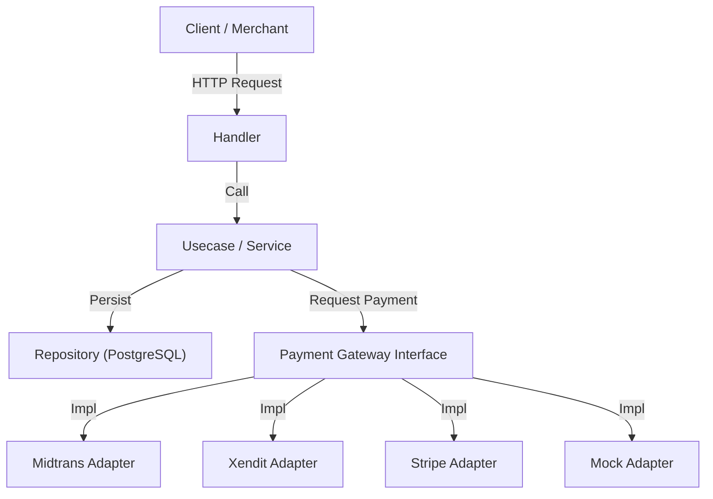

# Go Payment Aggregator

[](https://opensource.org/licenses/MIT)

A robust, enterprise-grade Payment Aggregator service designed to unify multiple payment gateways (Midtrans, Xendit, Stripe) under a single, standardized API. Built with **Go (Golang)**, adhering to **Clean Architecture** principles to ensure scalability, maintainability, and testability.

---

## 📑 Table of Contents

- [Features](#-features)
- [Architecture](#-architecture)
- [Tech Stack](#-tech-stack)
- [Getting Started](#-getting-started)
  - [Prerequisites](#prerequisites)
  - [Installation](#installation)
  - [Configuration](#configuration)
- [Usage](#-usage)
- [API Documentation](#-api-documentation)
- [Testing](#-testing)
- [Project Structure](#-project-structure)
- [License](#-license)

---

## 🚀 Features

- **Multi-Gateway Support**: Seamless integration with **Midtrans**, **Xendit**, and **Stripe**, plus a **Mock** provider for local development and testing.
- **Unified API Interface**: A single `CreateTransaction` endpoint intelligently routes requests to the appropriate provider.
- **Resilient Webhook Handling**: Standardized, secure webhook processing pipeline for all providers.
- **Merchant Callbacks**: Automatic notification system that relays payment status changes back to the merchant's registered `callback_url`.
- **Idempotency & Safety**: Built-in duplicate order protection to prevent double-spending.
- **Containerized**: Fully dockerized environment with PostgreSQL and Redis support for easy deployment.
- **Observability**: Structured logging with Logrus.

## 🏗 Architecture

This project follows **Hexagonal Architecture (Ports and Adapters)** to decouple business logic from external concerns.



## 🛠 Tech Stack

- **Core**: Go 1.25+
- **Web Framework**: Gin Gonic
- **Database**: PostgreSQL
- **Caching**: Redis (Supported in config)
- **ORM**: GORM
- **Configuration**: Viper
- **Logging**: Logrus
- **Testing**: Testify (Suite, Assert, Mock)
- **Containerization**: Docker & Docker Compose

## 💻 Getting Started

### Prerequisites

- [Go](https://golang.org/dl/) 1.25 or higher
- [Docker](https://www.docker.com/products/docker-desktop) & Docker Compose

### Installation

1.  **Clone the repository**
    ```bash
    git clone https://github.com/rezkysyaputra/go-payment-aggregator.git
    cd go-payment-aggregator
    ```

2.  **Setup Configuration**
    Copy the example configuration file.
    ```bash
    cp .env.example .env
    ```

### Configuration

Edit `.env` with your credentials.

| Key | Description | Default |
| :--- | :--- | :--- |
| `APP_NAME` | Application Name | `go-payment-aggregator` |
| `SERVER_PORT` | HTTP Port | `8080` |
| `DATABASE_*` | Database connection details | - |
| `MIDTRANS_SERVER_KEY` | Midtrans Server Key | - |
| `XENDIT_API_KEY` | Xendit Secret API Key | - |
| `STRIPE_SECRET_KEY` | Stripe Secret Key | - |

## 🚀 Usage

### Running with Docker (Recommended)

The easiest way to run the application is using Docker Compose. This will start the API server and the PostgreSQL database.

```bash
docker-compose up -d --build
```

The API will be accessible at `http://localhost:8080`.

### Running Locally

1.  **Start Dependencies (DB)**
    ```bash
    docker-compose up -d db
    ```

2.  **Run Migrations**
    ```bash
    # Ensure migrations are applied (adjust command based on your setup)
    # Example: migrate -path database/migrations -database "postgresql://..." up
    ```

3.  **Start the Server**
    ```bash
    go run cmd/server/main.go
    ```

## 📡 API Documentation

The API follows RESTful conventions. A full OpenAPI specification is provided in `api/openapi.json`.

### Key Endpoints

| Method | Endpoint | Description |
| :--- | :--- | :--- |
| `POST` | `/v1/merchant/register` | Register a new merchant to get an API Key. |
| `POST` | `/v1/transaction` | Create a new transaction (supports `midtrans`, `xendit`, `stripe`, `mock`). |
| `GET` | `/v1/transaction/{id}` | Retrieve transaction status by System ID. |
| `POST` | `/v1/webhook/midtrans` | Webhook endpoint for Midtrans. |
| `POST` | `/v1/webhook/xendit` | Webhook endpoint for Xendit. |
| `POST` | `/v1/webhook/stripe` | Webhook endpoint for Stripe. |

## 🧪 Testing

This project includes both **Unit Tests** (for business logic) and **Integration Tests** (for end-to-end flows).

### Run All Tests
```bash
go test ./... -v
```

### Run Unit Tests Only
Unit tests are located within the `internal` packages (e.g., usecases).
```bash
go test ./internal/... -v
```

### Run Integration Tests Only
Integration tests are located in the `test` directory and require a running database.
```bash
go test ./test/... -v
```

## 📂 Project Structure

```
go-payment-aggregator/
├── api/                # OpenAPI/Swagger definitions
├── cmd/                # Main applications of the project
│   ├── server/         # API Server entrypoint
│   └── worker/         # Background worker entrypoint
├── internal/
│   ├── config/         # Configuration loading
│   ├── delivery/       # HTTP Handlers, Middleware, Routes
│   ├── domain/         # Business entities and interfaces (Core)
│   ├── gateway/        # 3rd Party API Adapters (Midtrans, Xendit, Stripe)
│   ├── mocks/          # Mocks generated by Mockery
│   ├── pkg/            # Internal shared packages (Crypto, UUID, etc.)
│   ├── repository/     # Database implementations
│   └── usecase/        # Business logic implementations
└── test/               # Integration and E2E tests
```

## 📄 License

This project is licensed under the MIT License.

